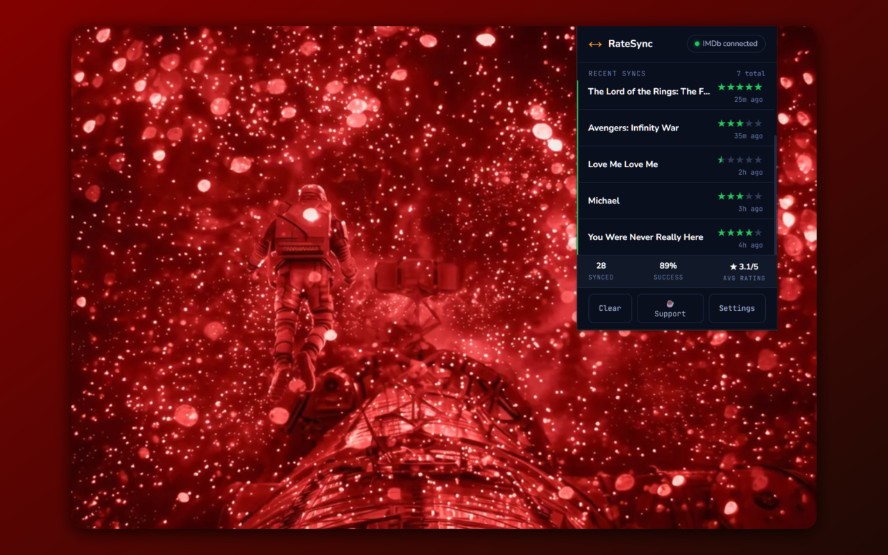

# RateSync

**Sync Letterboxd Rating to IMDb — automatically.**

RateSync is a Chrome extension that submits your Letterboxd rating to IMDb the moment you rate a film. No extra clicks, no switching tabs. Rate once, done on both.

---

## How It Works

1. You rate a film — on the film page's star widget, or from the log/diary dialog
2. RateSync catches the rating request as it leaves your browser
3. It resolves the film's IMDb ID from Letterboxd's own film data, falling back to TMDb when Letterboxd doesn't link to IMDb
4. It submits the equivalent rating to IMDb using your existing logged-in session
5. A toast on the Letterboxd page confirms each step — *IMDb sync initiated*, then *IMDb rating synced* (or the exact reason it failed)
6. If a sync fails for a transient reason it is retried once automatically, 5 seconds later; anything that still fails can be retried by hand from the popup

Letterboxd's 5-star scale is converted to IMDb's 10-point scale automatically.

---

## Features

- Automatic background sync — no interaction needed
- Works from both the film page and the log/diary dialog
- On-page status toasts — confirmation when your rating is captured, then the result (or the exact failure reason, with a retry hint)
- One automatic retry after 5 seconds before anything is reported as failed
- Sync log with film title, star rating, and timestamp
- Inline retry button on any failed sync
- Stats bar — total synced, success rate, average rating
- Filter by failed syncs or unique films only
- TMDb fallback for films without a direct IMDb link on Letterboxd (v4 token *or* v3 API key)
- Optional: open the IMDb page after a sync (only ever after IMDb confirms it)
- In-page notifications can be turned off in Settings
- Submits the rating with a fast, direct request first; only falls back to a browser tab if that fails (can be turned off in Settings, so a failure fails right away instead)
- IMDb login status indicator in the header

---

## Good To Know

**Why does an IMDb tab sometimes appear for a second?**
RateSync submits your rating with a quick, invisible request first. Only if that fails does it fall back to opening an IMDb tab (unless you've turned that off in Settings) — it stays in the background, never switches to it, and closes itself immediately afterwards. Either way, a tab only ever comes to the front if you turn on *Auto-open IMDb* **and** the sync succeeded — and once shown, that tab is yours: RateSync never reuses or closes it, and opens a new one for the next rating.

**Your IMDb rating is always overwritten.**
Every rating you give on Letterboxd replaces the one on IMDb, and there is no undo. *Retry* on an old failed sync is the one exception: it's refused (and the button hidden) if you've rated the film successfully since, so it can never resend a stale value over a newer one.

**Un-rating isn't synced.**
Removing a rating on Letterboxd does not remove it on IMDb — a known limitation. Syncs only go one way.

**You must be logged into IMDb** in the same browser profile; RateSync never sees or stores your password.

---

## Screenshots

| Letterboxd                                 | IMDb                           |
| ------------------------------------------ | ------------------------------ |
|  |  |

---

## Requirements

- Google Chrome
- A [Letterboxd](https://letterboxd.com) account
- An [IMDb](https://www.imdb.com) account — must be logged in on the same browser profile
- *(Optional)* A [TMDb API key](https://www.themoviedb.org/settings/api) (free) — only needed as a fallback for films Letterboxd doesn't directly link to IMDb. Either a v4 Read Access Token or a 32-character v3 API key works.

---

## Installation

### From Chrome Web Store

_(Coming soon)_

### Manual (Developer Mode)

1. Clone or download this repo
2. Open `chrome://extensions/`
3. Enable **Developer mode**
4. Click **Load unpacked** and select the `ratesync/` folder

After changing any code, click **⟳ reload** on the RateSync card — and reload any Letterboxd tabs that are already open, so they pick up the page-side scripts.

---

## Setup

1. Log in to [IMDb](https://www.imdb.com) in your browser — the extension uses your existing session
2. *(Optional)* Click the RateSync icon → **Settings**, turn on **TMDb lookup**, and paste your [TMDb API key](https://www.themoviedb.org/settings/api) (free — select _Personal Use_ when applying)
3. Rate a film on Letterboxd — the sync happens automatically

---

## For Developers

There is **no build step**: plain HTML/CSS/ES6+, loaded straight into Chrome. Request interception, the page-side rating hook, the resolution pipeline, IMDb submission, and the storage schema are all in `background.js`, `page-hook.js`, and `page-bridge.js` — see the header comments there for how the pieces fit together.

- **Tests:** `node --test "tests/*.test.js"` — no dependencies; runs `background.js` against a stubbed `chrome` API.
- **Store package:** `python scripts/pack.py` — zips only the files the manifest and popup reference, so `tests/` and `scripts/` never ship.

---

## Privacy

- Runs entirely in your browser — no external servers, no analytics, no tracking
- Your TMDb token is stored locally and only sent to TMDb for film ID lookups
- Your IMDb session is used only to submit your rating — never stored or shared
- Letterboxd sign-in and account forms are ignored entirely
- Full privacy policy: [PRIVACY_POLICY.md](PRIVACY_POLICY.md)

---

## Disclaimer

RateSync is an independent project and is not affiliated with, endorsed by, or sponsored by Letterboxd or IMDb. Letterboxd and IMDb are trademarks of their respective owners. It uses IMDb's website interface rather than an official public API. Use it at your own risk.

RateSync relies on IMDb and Letterboxd interfaces and may stop working if either changes its code. If that happens, please report it through the [feedback form](https://tally.so/r/68oB5B) or leave a review on the Chrome Web Store so I can update it.

## License

MIT
